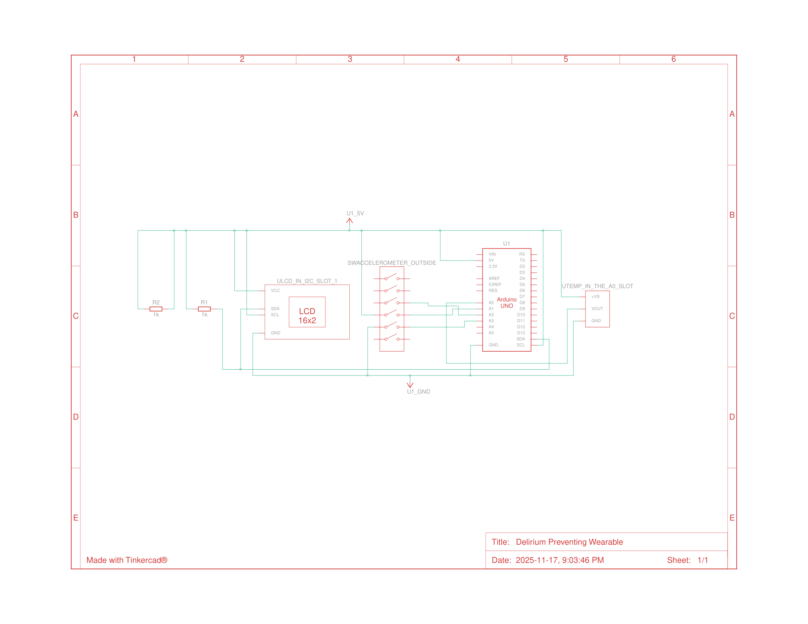

# Delirium Prevention Wearable System

A comprehensive system designed to monitor patient activity and environmental factors to help prevent hospital-induced delirium. It combines a wearable sensor unit, a data processing backend with a machine learning model, and a web-based frontend for real-time monitoring and control.

## Features

- **Real-Time Activity Monitoring**: Classifies patient activity (e.g., still, active) using a 1D-CNN model.
- **Inactivity Alerts**: A configurable timer tracks periods of inactivity and triggers alerts on the wearable and the web interface.
- **Sleep Environment Monitoring**: Tracks ambient temperature, light, and sound during sleep periods.
- **Web-Based Dashboard**: A React-based interface for visualizing data, managing the device state, and viewing alerts.
- **On-Device Data Recording**: The frontend allows for recording new training data for different activities.
- **In-App Model Training**: Train the machine learning model directly from the web interface with the newly recorded data.
- **Dual Firmware Support**: Includes stable firmware for Arduino and in-development firmware for a more powerful STM32 platform.

## System Architecture

The system is composed of three main components that communicate in real-time:

```
┌──────────────────┐      ┌──────────────────┐      ┌────────────────┐
│  Wearable Device │      │  Python Backend  │      │ React Frontend │
│ (Arduino/STM32)  ├----->│ (Flask-SocketIO) ├----->│   (Web App)    │
└──────────────────┘      └──────────────────┘      └────────────────┘
       ▲ │                  │ ▲                       ▲ │
       │ │ Serial Data      │ │ Socket.IO Events      │ │ User Input
       │ │ (Sensors)        │ │ (JSON)                │ │ (Controls)
       │ │                  │ │                       │ │
       │ └────────────────--│-▼-----------------------│-┘
       │                    │                         │
       │ LCD Commands       │ ML Inference & Logic    │ Visualizations
       └────────────────────┘                         └────────────────
```

## Technology Stack

- **Hardware**:
    - Arduino Uno/Nano/Mega (or compatible)
    - STM32 Nucleo-F401RE (in development)
    - Sensors: Accelerometer (ADXL335), Thermistor
    - 16x2 I2C LCD Display with RGB backlight
- **Firmware**:
    - C/C++ for Arduino (`.ino`)
    - C for STM32 using HAL libraries (in development)
- **Backend**:
    - Python 3.8+
    - Flask-SocketIO for real-time web communication
    - PySerial for hardware interface
    - PyTorch for the Machine Learning model
    - Scikit-learn & Joblib for data scaling
- **Frontend**:
    - React 19 with TypeScript
    - Vite as a build tool
    - Socket.io-client for backend communication
    - CSS for styling

## Getting Started

### Prerequisites

- **Hardware**: An assembled wearable device based on the Arduino platform.
- **Software**:
    - [Arduino IDE](https://www.arduino.cc/en/software)
    - [Python 3.8+](https://www.python.org/downloads/)
    - [Node.js 16+](https://nodejs.org/) (includes npm)

### 1. Setup the Hardware

Here's a schematic layout of how the hardware was implemented for this project.



### 2. Setup the Firmware

1.  Connect the Arduino device to your computer.
2.  Open `firmware/arduino_firmware/arduino_firmware.ino` in the Arduino IDE.
3.  Select the correct board and COM port from the `Tools` menu.
4.  Click the "Upload" button.
5. Test the firmware using the Python scripts in the `test_scripts` and run `test_lcd.py` and `test_serial.py`.

### 3. Setup the Backend

1.  Navigate to the backend directory:
    ```bash
    cd backend
    ```
2.  **Important**: Open `shared_config.py` and change the `SERIAL_PORT` variable to match the COM port of your Arduino.
    ```python
    # Example for macOS
    SERIAL_PORT = '/dev/tty.usbmodem1101'
    # Example for Windows
    # SERIAL_PORT = 'COM3'
    ```
3.  Install the required Python packages:
    ```bash
    pip install -r requirements.txt
    ```
4.  Run the backend server:
    ```bash
    python main.py
    ```
    The server will start and attempt to connect to the Arduino.

### 4. Setup the Frontend

1.  In a new terminal, navigate to the frontend directory:
    ```bash
    cd frontend
    ```
2.  Install the required Node.js packages:
    ```bash
    npm install
    ```
3.  Start the development server:
    ```bash
    npm run dev
    ```
4.  Open your web browser and go to `http://localhost:5173`.

## How to Use

The web application has two main tabs: **Monitor** and **Training & Data**.

### Monitoring a Patient

1.  Go to the **Monitor** tab.
2.  Set the device mode:
    - **Active Mode**: Monitors patient movement and inactivity. The inactivity timer will decrease when the patient is still and reset upon significant movement. An alert is triggered when the timer reaches zero.
    - **Sleep Mode**: Monitors ambient temperature and sleep duration.
3.  The patient's current status is displayed in real-time.

### Training a New Model

The system comes with a pre-trained `test` model. To create a custom model for a new patient:

1.  Go to the **Training & Data** tab.
2.  Enter a unique **Patient ID**.
3.  Use the **Data Recorder** to record samples for each activity (`still`, `walking`, `waving`).
    - Select an activity.
    - Click "Start Recording" and perform the activity for at least 30 seconds.
    - Click "Stop Recording".
    - Repeat for all activities.
4.  Once data has been collected for all activities, use the **Model Trainer** card and click "Train Model".
5.  The backend will train a new model and scaler, saving them as `{patient_id}_model.pth` and `{patient_id}_scaler.joblib`. The system will automatically load and use this new model.

## Firmware Development Status

-   **Arduino**: The firmware located in `firmware/arduino_firmware` is stable and is the current version for use with the system.
-   **STM32**: The code in `firmware/stm32_firmware` is **in development**. It is intended as a future, more powerful alternative to the Arduino but is not yet fully functional or integrated with the backend.

## Project Structure

```
/
├── firmware/
│   ├── arduino_firmware/     # Stable firmware for Arduino
│   └── stm32_firmware/       # In-development firmware for STM32
├── backend/
│   ├── main.py               # Main Flask-SocketIO server
│   ├── train_model.py        # ML model definition and training logic
│   ├── shared_config.py      # Shared configuration (e.g., SERIAL_PORT)
│   └── requirements.txt      # Python dependencies
└── frontend/
    ├── src/
    │   ├── App.tsx           # Main React component
    │   ├── components/       # UI components (ActivityMonitor, etc.)
    │   └── services/         # Socket.IO communication logic
    ├── package.json          # Node.js dependencies
    └── vite.config.ts        # Vite configuration
```